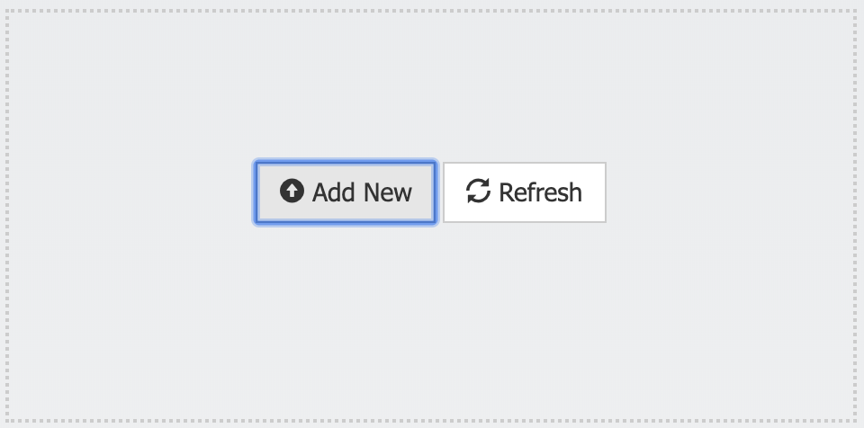
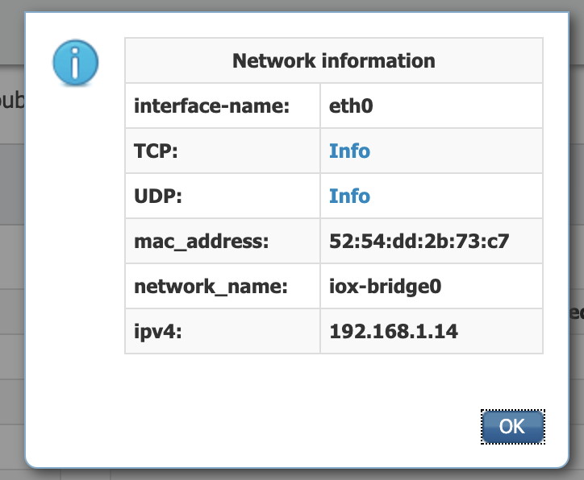

# Running Linux Ubuntu with SSH as an IOx Application

In some cases, all you need is just a Linux environment to experiment or play with, or to build applications on the top of it. This image was build in the context of a device validation for Microsoft Azure and it needed the Azuze Python SDK.

This image is composed of:

* Ubuntu 20.04 ‘Focal Fossa’
* OpenSSH with remote access on port 22
* A user "root" with password "root" (change that password!)
* (optional) Python 3.8 with Microsoft Azure Python SDK

You will need a build machine with Docker and ioxclient installed. I recommend a Linux machine but it can also be build on other platforms.

Ìf you want to save the hassle to build it yourself and start deploying right away, the IOx application is available for you [here](../ubuntu-with-ssh-x86.tar)

### Setting you up

Copy in your working directory the [Dockerfile](Dockerfile) and [package.yaml](package.yaml).

Make sure you have a version of [Docker CE](https://docs.docker.com/install/linux/docker-ce/ubuntu/) suitable for your platform and installed:

    docker version

Make sure you have [ioxclient](https://developer.cisco.com/docs/iox/#!iox-resource-downloads) installed:

    ioxclient --version

### Building the Docker image

From that directory, build the Docker image. This will take some time and required internet access to pull all the code:

    docker build -t ubuntu-with-ssh-x86 .

### Building the IOx application

Next up, need to package that Docker image as an IOx application. Run the following command:

    ioxclient docker package -n ubuntu-with-ssh-x86 ubuntu-with-ssh-x86 .

You should now have a package called

    etychon@etychon-centos ~/iox: ls -al ubuntu-with-ssh-x86.tar
    -rw-r--r--. 1 etychon etychon 273307648 Feb 26 22:15 ubuntu-with-ssh-x86.tar

### Deploying and running the IOx application

On your x86, IOx-enabled gateway (ie: Cisco IR829) load the IOx application from the Cisco IOx Local Manager:

#### For Cisco IR829

Instructions might be slightly different on other platforms, always check Cisco documentation on Cisco DevNet.

By default the networking is configured as `iox-bridge0`, don't change that. If your router is configured properly, the running container will receive a DHCP address.

Activate and then start the IOx application. In App-Info tab, click on "eth0" to find the running container IP address:

Since the container is listening on an internal IP address, one will need to create a NAT rule to forward an outside IP and port number to that inside IP and port number. On Cisco IOS CLI and in this case, configure:

    IR800(config)#ip nat inside source static tcp 192.168.1.14 22 interface Vlan1 3333                                                                                                         
You can now access the container with SSH by using the router outside IP address, in this case my Vlan1 IP address was 192.168.2.100. Therefore:

    etychon@ETYCHON-M-D2ZR ~ ssh -l root 192.168.2.100 -p 3333
    root@192.168.2.100's password:
    Last login: Wed Feb 26 21:40:52 2020 from 192.168.2.88
    root@ubuntu:~#
